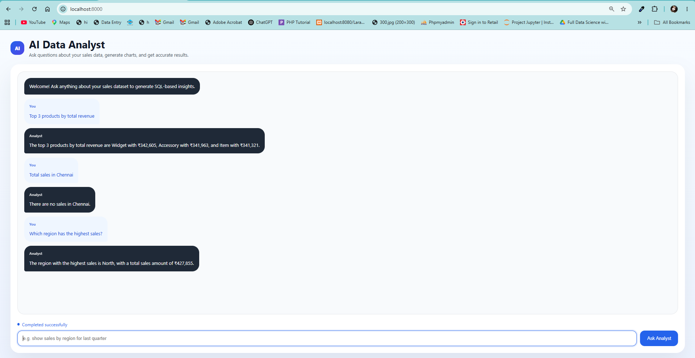

# AI Data Analyst (Text-to-SQL Agent)

An LLM-powered agent that answers natural-language questions about sales data by
writing its own SQL, querying a MySQL database, and returning the answer with a
chart — no hardcoded questions. Built with Python, FastAPI, and Docker.

> Ask *"top 3 products by revenue"* or *"sales report by region"* in plain English,
> and the agent decides which database tool to call, runs the query, and replies
> with a chart.

---

## Demo

<!--
  ADD A SCREENSHOT HERE — this is the most important part of the README.
  1. Run the app, ask a question, and take a screenshot showing the answer + chart.
  2. Save it in this repo as: screenshot.png
  3. The line below will then display it automatically.
-->


---

## What it does

- Understands questions asked in everyday language (many phrasings → one action).
- Generates SQL automatically from the user's question (text-to-SQL).
- Runs the query safely against MySQL (read-only SELECT queries only).
- Returns a written answer **and** a bar chart for report-style questions.
- Exposes a real-time API that any frontend or app can call.

## How it works

```
User question
   |
   v
LLM (Groq)  --decides which tool to call-->
   |
   v
Tool runs the SQL on MySQL
   |
   v
Result goes back to the LLM
   |
   v
Final answer (+ chart data) returned over the API
```

The LLM never touches the database directly. It only decides *which* function to
call; the Python code runs it, with a SELECT-only guardrail so generated SQL can
never modify data.

## Tech stack

| Layer | Technology |
| --- | --- |
| Language | Python |
| LLM | Groq (Llama 3.3) — OpenAI-compatible API |
| Database | MySQL |
| API | FastAPI |
| Frontend | HTML + Chart.js |
| Deployment | Docker + Docker Compose |

## Concepts demonstrated

Function calling / tool calling, tool selection, the agent loop, SQL generation,
structured output, REST API design, and containerized deployment.

---

## Running it locally

### Option A — with Docker (recommended)

```bash
# 1. Clone
git clone https://github.com/DhivyaSR/ai-data-analyst.git
cd ai-data-analyst

# 2. Create a .env file (see .env.example) with your Groq key + DB password

# 3. Start everything (agent + MySQL)
docker compose up -d --build
```

Then open **http://localhost:8000** in your browser and ask a question.

### Option B — without Docker

```bash
pip install -r requirements.txt
# set up MySQL and load init.sql
uvicorn main:app --reload
```

Open **http://localhost:8000/docs** to test the API.

---

## Example questions

- "Top 3 products by total revenue"
- "Total sales in Chennai"
- "Which region has the highest sales?"
- "Average sale amount by category"
- "Give me a sales report by region" (returns a chart)

---

## Environment variables

Create a `.env` file with:

```
GROQ_API_KEY=your_groq_key
DB_HOST=localhost
DB_USER=root
DB_PASSWORD=your_password
DB_NAME=analytics
```

(A `.env.example` is included; the real `.env` is gitignored and never committed.)

---

## About

Built as a hands-on project while moving from PHP/MySQL backend development into
AI application development. It demonstrates the core pattern behind modern AI
business tools: the LLM understands language and routes to tools, while the
application code owns the data access and business logic.
